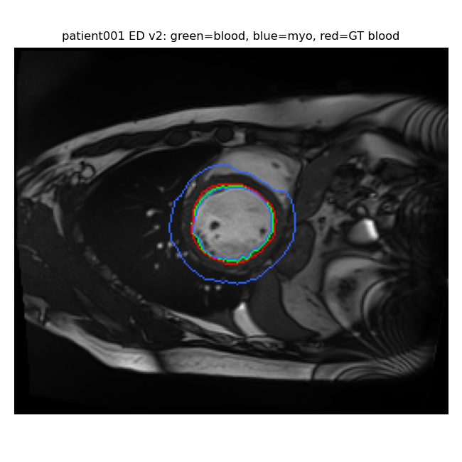

# Left-Ventricle Segmentation and Cardiac Function Analysis from Cine-MRI

A classical (non-deep-learning), semi-automatic pipeline that segments the left
ventricle (LV) in short-axis cine-MRI, computes clinical function indices, and
checks them against diagnostic criteria. Developed with the public
[Automated Cardiac Diagnosis Challenge (ACDC)](https://www.creatis.insa-lyon.fr/Challenge/acdc/)
dataset.

Group project for Applied Medical Image Analysis, MSc Medical Engineering &
Analytics, Carinthia University of Applied Sciences (2026).

## Contributors
Laura Telle, Vanessa Lukasser and Allison Young contributed equally to this project.

---

## Overview

From a single user click inside the LV blood pool at end-diastole (ED) and
end-systole (ES), the pipeline:

1. Segments the LV blood pool on the seed slice using intensity normalisation,
   a circular region of interest around the seed, region growing and an Otsu
   threshold cap
2. Propagates the segmentation slice by slice (centroid tracking, area guards
   and an adaptive threshold "retry ladder" to stop leakage) and across all
   cardiac frames, interpolating dropout frames
3. Segments the myocardium by expanding outward from the endocardial contour
   ring by ring until the epicardial border is reached
4. Computes LVEDV, LVESV, stroke volume, ejection fraction (EF), EDV index
   (normalised by body surface area) and mean diastolic wall thickness
5. Validates the segmentation against expert ground truth (Dice and Jaccard)
   and checks whether the indices agree with the criteria for the patient's
   known group:

| Group | EF | EDV index | Wall thickness |
|---|---|---|---|
| Normal (NOR) | > 50% | – | < 12 mm |
| Dilated cardiomyopathy (DCM) | < 40% | > 100 mL/m² | < 12 mm |
| Hypertrophic cardiomyopathy (HCM) | > 55% | – | > 15 mm |

This is a consistency check, not a classifier.

## Results

The pipeline was run on all 100 ACDC training patients. After visual quality
review of the segmentation overlays, 12 patients spanning three groups (4 DCM,
5 NOR, 3 HCM) were analysed in depth.

**12 selected patients**

| | LV blood pool | Myocardium |
|---|---|---|
| Mean Dice, ED | 0.877 | 0.541 |
| Mean Dice, ES | 0.804 | 0.640 |

The computed indices agreed with the diagnostic criteria for all 12 patients.
DCM patients showed low EF (19–30%) and high EDV index (122–174 mL/m²), HCM
patients showed preserved EF with diastolic wall thickness of 17–20 mm, and NOR
patients had EF of 56–79% with walls under 12 mm.




*Green: segmented blood pool. Blue: segmented myocardium. Red: expert ground truth.*

**Limitations.** The method depends on manual seed placement, the myocardium
model does not account for papillary muscles or trabeculae, and LV volumes are
slightly underestimated where the ventricle is truncated at the base or apex.
Automated seeding or deep-learning refinement would be needed to scale to larger
cohorts.

---

## How to run

### 1. Requirements

Python 3.9 or newer:

```
pip install -r requirements.txt
```

The ACDC training dataset is required and is not included in this repository.
Download it from the official ACDC website. You need the folder named `training`,
which contains one sub-folder per patient (`patient001` … `patient100`), each
holding that patient's `Info.cfg`, the 4D cine (`patientNNN_4d.nii`), and the
ED/ES frames and ground-truth label files.

### 2. Patients analysed by default

The script is pre-set to process these 12 patients and ignores the rest:

```
patient001  patient004  patient012  patient019
patient021  patient031  patient040
patient067  patient069  patient070  patient072  patient075
```

To run all 100 patients, add `--all-patients`. To run a custom set, use
`--patients patient005 patient030 …`.

### 3. Running it

Open a terminal in the folder containing `lv_segmentation.py` and run
(replacing the two paths with your own):

```
python lv_segmentation.py --no-show --reset-seeds --dataset "PATH/TO/ACDC/training" --output "PATH/TO/output"
```

- `--dataset`: the `training` folder containing the `patientNNN` folders
- `--output`: any folder for results; it is created if it does not exist

On Windows, keep the quotes around paths that contain spaces.

### 4. Flags

| Flag | Effect |
|---|---|
| `--reset-seeds` | Ignores previously saved seed clicks and asks for a fresh click on every patient |
| `--no-show` | Saves result figures without displaying them (the seed window still appears) |
| `--dataset` | Where to read patient data from |
| `--output` | Where to write results |
| `--roi-radius-mm` | Search radius around the seed (default 38 mm) |
| `--blood-frac` | Seed-relative blood threshold fraction (default 0.50) |

### 5. The seed clicks

For each patient, and for both ED and ES, the script shows a montage of all
slices, asks you to type the number of the slice with the clearest LV cavity,
then asks you to click once inside the bright LV blood pool. With 12 patients
that is 24 clicks. Clicks are saved to `seeds.json` after each patient, so an
interrupted run can resume without re-clicking (unless `--reset-seeds` is used).

### 6. Outputs

Written to the `--output` folder:

- `summary.csv`: one row per patient with EF, EDV index, wall thickness,
  Dice/Jaccard scores, coverage notes and group agreement
- `summary_scatter.png`: EF vs. wall thickness, coloured by group, with the
  clinical threshold lines
- Per-patient figures: ED and ES overlays, the volume curve over the cardiac
  cycle, and the seed montages

### 7. Common issues

- **`ModuleNotFoundError`**: the required packages are not installed in the
  Python environment you are using. Run `pip install -r requirements.txt`.
- **`FileNotFoundError: … patientNNN/Info.cfg`**: `--dataset` must point to the
  folder that directly contains the `patientNNN` sub-folders.
- **No seed window appears**: the click step needs an interactive display, so
  run the script in a normal desktop session.

## Reference

Bernard O, Lalande A, Zotti C, et al. Deep learning techniques for automatic MRI
cardiac multi-structures segmentation and diagnosis: is the problem solved?
*IEEE Transactions on Medical Imaging*. 2018;37(11):2514–2525.
doi:10.1109/TMI.2018.2837502
